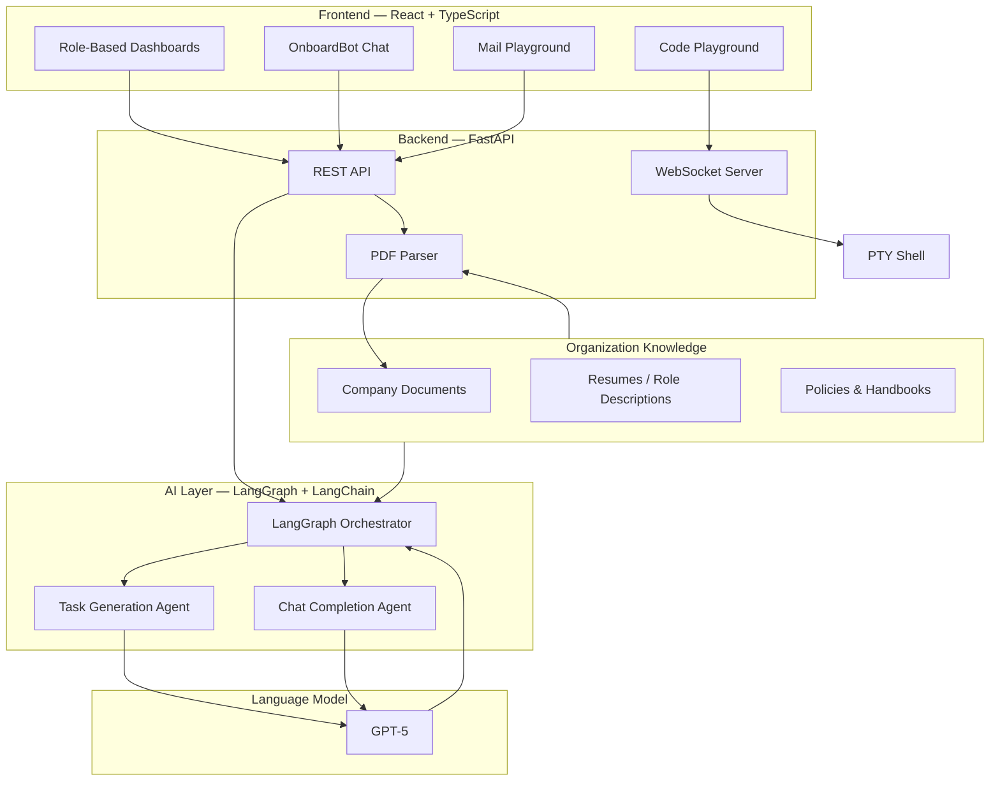
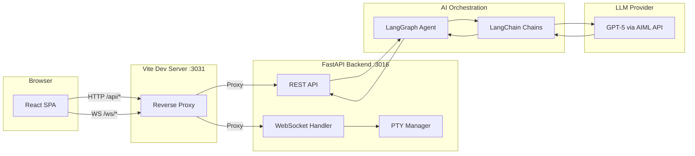

<div align="center">

# OnboardEase

**The AI-powered onboarding operating system that gets new hires productive in 48 hours.**

[](https://react.dev)
[](https://www.typescriptlang.org)
[](https://fastapi.tiangolo.com)
[](https://python.org)
[](https://langchain-ai.github.io/langgraph/)
[](https://langchain.com)
[](https://openai.com)
[](https://youth-code-x-ai-29376.devpost.com/)

**Built for [Youth Code x AI Hackathon](https://youth-code-x-ai-29376.devpost.com/)** — organized by Youth Code Foundation

</div>

---

## Table of Contents

- [Problem Statement](#problem-statement)
- [Solution Overview](#solution-overview)
- [Key Features](#key-features)
- [Target Users](#target-users)
- [Technologies Used](#technologies-used)
- [System Architecture](#system-architecture)
- [Getting Started](#getting-started)
- [API Documentation](#api-documentation)
- [Project Structure](#project-structure)
- [Future Roadmap](#future-roadmap)

---

## Problem Statement

Employee onboarding is one of the most critical — and most broken — processes in modern organizations. When a new hire joins a company, they are dropped into a fragmented landscape of scattered documents, outdated wikis, disconnected tooling, and ad-hoc introductions. There is no single system that owns the onboarding journey end-to-end. The result: new employees spend their first weeks navigating confusion instead of contributing value.

Industry research consistently shows that structured onboarding significantly improves employee retention and productivity. Yet most organizations still rely on static checklists, one-size-fits-all handbooks, and manual HR coordination. The onboarding experience is passive — read this document, watch this video, fill out this form. There is no personalization based on role, no adaptive learning path, and no real-time feedback loop to identify struggling hires before it's too late.

The cost of this failure compounds. HR teams burn hours on repetitive administrative tasks that could be automated. Mentors are assigned blindly, with no visibility into their mentee's progress. Managers have no dashboard to track ramp-up velocity. And new hires — the people who matter most in this equation — are left to figure things out on their own, leading to slower time-to-productivity, lower engagement, and higher early-stage attrition.

OnboardEase exists because onboarding should not be a passive document dump. It should be an intelligent, interactive, and personalized experience — one that adapts to the individual, automates the busywork, and gives every stakeholder real-time visibility into the journey from Day 1 to full productivity.

---

## Solution Overview

OnboardEase is an AI-powered onboarding operating system that transforms the new-hire experience from a static checklist into an active, learn-by-doing journey. It connects HR teams, managers, mentors, and new hires in a single unified platform with role-specific dashboards, intelligent automation, and real-time collaboration.

At its core, OnboardEase uses **LangGraph** and **LangChain** to orchestrate agentic AI workflows that analyze organizational documents — employee handbooks, compliance policies, role descriptions — and automatically generate personalized 30-day onboarding plans tailored to each hire's role, department, and experience level. These plans are not static task lists: they are adaptive roadmaps with interactive learning environments including a **live code playground**, **email simulations**, and an **AI chat assistant** that answers questions contextually from your organization's knowledge base.

What makes OnboardEase fundamentally different from traditional onboarding tools is the shift from **passive reading to active doing**. New hires don't just read about company tools — they practice using them in sandboxed environments. Mentors don't just check in periodically — they have real-time dashboards showing exactly where their mentee is struggling. HR doesn't manually create task lists — AI generates them from uploaded documents in minutes.



---

## Key Features

### AI Task Builder

Generate complete, role-specific onboarding task plans from a job title, role description, or uploaded resume. The LangGraph-powered agent analyzes the input context and produces structured, sequenced tasks with estimated durations, priority levels, and category tags — transforming hours of manual HR planning into a single interaction.

### Bulk Task Generation

Scale onboarding across your entire organization. Upload company documents — employee handbooks, compliance materials, training guides — and the AI Document Intelligence Engine extracts actionable onboarding requirements, then generates complete 30-day plans for any role in minutes. One click replaces weeks of manual task creation.

### Code Playground

A full-featured, in-browser development environment powered by **Monaco Editor** (the same engine behind VS Code) paired with a real **PTY bash terminal** connected via WebSocket. New hires can practice coding exercises, explore company repositories, and complete technical onboarding tasks — all without leaving the platform. No local setup required.

### OnboardBot — AI Chat Assistant

A context-aware AI assistant powered by GPT-5 that serves as a 24/7 onboarding companion. OnboardBot answers questions about company policies, explains tasks, provides guidance on next steps, and escalates issues when needed. It maintains conversation history and understands the hire's current onboarding stage for contextually relevant responses.

### Mail Playground

A simulated email environment where new hires practice professional communication scenarios they will encounter in their role. From client outreach to internal status updates, the Mail Playground uses AI to generate realistic B2B correspondence and provide feedback — building communication skills in a safe, sandboxed environment.

### Smart Document Viewer

An integrated PDF viewer that allows new hires to read onboarding documents, company policies, and training materials inline without switching applications. Documents are linked directly to relevant tasks, creating a seamless connection between "what to learn" and "where to learn it."

### Role-Based Dashboards

Four purpose-built dashboard experiences — **New Hire**, **Mentor**, **HR**, and **Admin** — each designed for the specific workflows and visibility needs of that role. Every user sees exactly what they need: their tasks, their mentees, their team's progress, or the organization-wide onboarding health metrics.

### Progress Tracking & Analytics

Real-time visibility into onboarding progress at every level. New hires track their own completion. Mentors monitor mentee advancement. HR and Admin dashboards surface aggregated metrics — completion rates, task velocity, engagement indicators — enabling data-driven decisions about onboarding effectiveness.

### Employee & Mentor Management

A complete management layer for adding, assigning, and tracking employees and mentors. Admins can onboard new hires, assign compatible mentors, manage role configurations, and oversee the entire onboarding pipeline from a single interface. Mentor-mentee relationships are tracked with full context on assigned tasks and progress.

---

## Target Users

| User Type | Challenge | How OnboardEase Helps |
|---|---|---|
| **New Hire** | Overwhelmed by scattered documents, unclear priorities, no single source of truth for what to do next | Personalized 30-day roadmap, AI assistant for instant answers, interactive code and email playgrounds, clear task sequencing with progress tracking |
| **Mentor / Buddy** | No visibility into mentee progress, unclear when to intervene, ad-hoc check-ins with no structure | Real-time mentee dashboard, task-level progress tracking, AI-generated mentee-specific task plans, structured collaboration tools |
| **HR Manager** | Manual task creation for every hire, repetitive document distribution, no scalable onboarding process | Bulk task generation from documents, AI-powered plan creation, organization-wide progress dashboards, automated workflow management |
| **Team Lead** | Slow ramp-up time for new team members, no metrics on onboarding effectiveness, inconsistent experiences across hires | Progress analytics, standardized onboarding templates, visibility into individual and team-level onboarding velocity |
| **Administrator** | Managing employees, mentors, documents, and configurations across the entire onboarding system | Full platform control — employee and mentor management, bulk operations, role configuration, system-wide analytics and settings |

---

## Technologies Used

### Frontend

| Technology | Purpose |
|---|---|
| React 18 | Component-based UI with concurrent rendering |
| TypeScript 5.6 | Type-safe development across the entire frontend |
| Vite 5 | Fast build tooling, HMR, and dev server with proxy support |
| Tailwind CSS 3.4 | Utility-first styling for rapid, consistent UI development |
| React Router v6 | Client-side routing with role-based route protection |
| Monaco Editor | VS Code-grade in-browser code editor for the playground |
| xterm.js 6 | Terminal emulator rendering real PTY shell sessions |
| Axios | HTTP client for API communication |
| Lucide React | Consistent, modern icon system |

### Backend

| Technology | Purpose |
|---|---|
| FastAPI 0.115 | High-performance async REST API and WebSocket server |
| Uvicorn | ASGI server for production-grade request handling |
| WebSockets | Real-time bidirectional communication for PTY terminal |
| Pydantic 2.9 | Request/response validation and serialization |
| PyPDF2 | Resume and document parsing for AI ingestion |
| ptyprocess | Real PTY shell process management for the code playground |
| python-dotenv | Environment configuration management |

### AI & Automation

| Technology | Purpose |
|---|---|
| LangGraph 0.2 | Agentic workflow orchestration for multi-step AI tasks |
| LangChain 0.3 | LLM abstraction layer, prompt management, and chain composition |
| GPT-5 | Core language model for task generation, chat, and document analysis |
| AIML API | Model inference endpoint for OnboardBot and email simulation |

### Infrastructure & Tooling

| Technology | Purpose |
|---|---|
| Node.js 18+ | Frontend runtime environment |
| Python 3.12+ | Backend runtime environment |
| PostCSS + Autoprefixer | CSS processing pipeline |
| ESLint + TypeScript Compiler | Code quality and type checking |

---

## System Architecture

### High-Level Architecture



### Data Flow

The following sequence describes the end-to-end flow when a user generates an AI-powered onboarding plan:

1. **User Action** — An HR manager or admin uploads company documents and specifies a target role via the React dashboard.
2. **API Request** — The frontend sends a `POST /api/generate` request to the FastAPI backend with the role context and document references.
3. **Document Processing** — PyPDF2 extracts text content from uploaded PDFs. The parsed content is structured and passed to the AI layer.
4. **LangGraph Orchestration** — The LangGraph agent receives the parsed context and initiates a multi-step workflow: analyzing the role requirements, identifying relevant document sections, and structuring the onboarding plan.
5. **GPT-5 Reasoning** — At each workflow step, LangChain sends structured prompts to GPT-5 via the AIML API. The model generates role-specific tasks, estimates durations, assigns priorities, and sequences the plan logically.
6. **Response Generation** — The LangGraph agent aggregates the model outputs into a structured JSON response containing the complete onboarding plan with tasks, categories, and metadata.
7. **Dashboard Update** — The React frontend receives the response and renders the generated plan in the appropriate dashboard — ready for review, editing, and assignment to new hires.

---

## Getting Started

### Prerequisites

| Requirement | Version |
|---|---|
| Node.js | >= 18 |
| Python | >= 3.12 |
| pip | Latest |

### Frontend Setup

```bash
cd onboardease

# Install dependencies
npm install

# Start the development server
npm run dev
```

The frontend will be available at `http://localhost:3031`.

### Backend Setup

```bash
cd onboarding-agent

# Install Python dependencies
pip install -r requirements.txt
```

### Environment Variables

Create a `.env` file in the project root (see `.env.example` for reference):

```env
# Backend server port
PORT=3016

# AIML API key for OnboardBot and AI features
VITE_AIML_API_KEY=your_aiml_api_key

# Deploy AI organization ID
VITE_DEPLOY_AI_ORG_ID=your_org_id

# (Optional) Override data API URL — defaults to http://localhost:3016
VITE_DATA_API_URL=

# (Optional) Override PTY WebSocket URL — defaults to current host
VITE_PTY_WS_URL=
```

### Running Locally

```bash
# Terminal 1 — Start the backend
cd onboarding-agent
python3 main.py
# API available at http://localhost:3016

# Terminal 2 — Start the frontend
npm run dev
# App available at http://localhost:3031
```

The Vite dev server automatically proxies `/api` and `/ws` requests to the backend — no additional CORS or proxy configuration is needed.

### Development Workflow

```bash
# Type checking
npm run build        # Runs tsc + vite build

# Production preview
npm run preview      # Serves the production build on port 3031
```

---

## API Documentation

### `GET /health`

Health check endpoint for monitoring and deployment verification.

**Response:**

```json
{
  "status": "ok"
}
```

---

### `POST /api/generate`

Generate a complete onboarding task plan from a role description or contextual input.

**Request:**

```json
{
  "role": "Frontend Engineer",
  "context": "React/TypeScript team, 12-person startup, uses GitHub and Slack",
  "duration_days": 30
}
```

**Response:**

```json
{
  "tasks": [
    {
      "title": "Complete development environment setup",
      "description": "Install Node.js, clone the repository, and verify the local build runs successfully.",
      "category": "Technical Setup",
      "priority": "high",
      "estimated_hours": 2,
      "day": 1
    },
    {
      "title": "Review frontend architecture documentation",
      "description": "Read through the component structure, routing patterns, and state management approach used in the codebase.",
      "category": "Knowledge Transfer",
      "priority": "high",
      "estimated_hours": 3,
      "day": 1
    }
  ]
}
```

---

### `POST /api/refine`

Refine and improve an existing set of onboarding tasks with AI-powered suggestions.

**Request:**

```json
{
  "tasks": [
    {
      "title": "Set up dev environment",
      "description": "Install tools",
      "category": "Setup",
      "priority": "high"
    }
  ],
  "feedback": "Make tasks more specific and add estimated completion times"
}
```

**Response:**

```json
{
  "tasks": [
    {
      "title": "Configure local development environment",
      "description": "Install Node.js 18+, clone the repository, run npm install, and verify the dev server starts without errors. Document any issues encountered.",
      "category": "Technical Setup",
      "priority": "high",
      "estimated_hours": 1.5
    }
  ]
}
```

---

### `POST /api/parse-resume`

Extract structured information from an uploaded resume or document file (PDF or TXT).

**Request:**

```
Content-Type: multipart/form-data

file: <resume.pdf>
```

**Response:**

```json
{
  "name": "Jordan Rivera",
  "role": "Frontend Engineer",
  "skills": ["React", "TypeScript", "Node.js", "GraphQL"],
  "experience_years": 3,
  "raw_text": "..."
}
```

---

### `WS /ws/pty`

WebSocket endpoint that establishes a real PTY (pseudo-terminal) session. The client connects via WebSocket and exchanges terminal I/O in real time, enabling a fully interactive bash shell in the browser.

**Connection:**

```
ws://localhost:3016/ws/pty
```

**Protocol:** Binary frames containing terminal input/output data, compatible with xterm.js on the client side.

---

## Project Structure

```
onboardease/
├── src/
│   ├── pages/                    # Route-level page components
│   │   ├── LandingPage.tsx       # Public marketing and product overview
│   │   ├── LoginPage.tsx         # Role selection and authentication
│   │   ├── NewHirePage.tsx       # New hire onboarding dashboard
│   │   ├── MentorPage.tsx        # Mentor tracking and management
│   │   ├── AdminPage.tsx         # Admin control panel
│   │   ├── HRPage.tsx            # HR operations dashboard
│   │   └── SetupPage.tsx         # Organization setup wizard
│   │
│   ├── components/
│   │   ├── common/               # Shared UI — Navbar, Footer, Logo, AIChatWidget
│   │   ├── dashboard/            # Role-specific dashboard panels
│   │   ├── landing/              # Landing page sections — Hero, Features, Pricing
│   │   ├── modals/               # Feature modals — AI builder, code playground, etc.
│   │   ├── chat/                 # OnboardBot chat components
│   │   └── setup/                # Onboarding setup wizard flow
│   │
│   ├── context/                  # Global application state (AppContext + reducer)
│   ├── services/                 # AI service integrations and API clients
│   ├── index.css                 # Global styles and Tailwind directives
│   └── main.tsx                  # Application entry point
│
├── onboarding-agent/             # Python FastAPI backend
│   ├── main.py                   # FastAPI app — REST endpoints, WebSocket PTY
│   ├── agent.py                  # LangGraph onboarding agent orchestration
│   ├── models.py                 # Pydantic request/response schemas
│   ├── requirements.txt          # Python dependencies
│   └── .env                      # Environment configuration
│
├── index.html                    # HTML entry point with meta tags
├── vite.config.ts                # Vite build and dev server configuration
├── tailwind.config.js            # Tailwind CSS theme and plugin configuration
├── tsconfig.json                 # TypeScript compiler configuration
├── package.json                  # Node.js dependencies and scripts
└── .env.example                  # Environment variable reference
```

---

## Future Roadmap

| Enhancement | Description |
|---|---|
| **LMS Integrations** | Connect with existing learning management systems (Coursera, Udemy for Business, internal LMS) to embed training content directly into onboarding plans |
| **Slack & Teams Integration** | Automated onboarding notifications, buddy introductions, and check-in reminders delivered natively in team communication tools |
| **Enterprise SSO** | SAML 2.0 and OIDC-based single sign-on for seamless enterprise identity integration |
| **Advanced Analytics Dashboard** | Predictive analytics for at-risk hires, cohort analysis, department-level benchmarking, and onboarding ROI tracking |
| **Knowledge Graph Onboarding** | Build an organizational knowledge graph from uploaded documents to enable relationship-aware task generation and contextual AI responses |
| **Multi-Language Support** | Internationalization of the platform UI and AI-generated content to support global onboarding operations |
| **Mobile Experience** | Responsive native mobile experience for new hires to complete tasks and access OnboardBot on the go |
| **Docker & Cloud Deployment** | Containerized deployment with Docker Compose and one-click cloud deployment templates |

---

<div align="center">

**OnboardEase** — Transforming onboarding from a checklist into a journey.

Built for **[Youth Code x AI Hackathon](https://youth-code-x-ai-29376.devpost.com/)** by the Youth Code Foundation — harnessing AI to create innovative solutions for real-world challenges in business, education, and communities.

</div>
